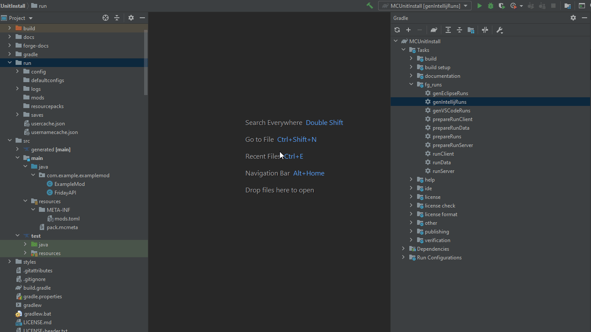
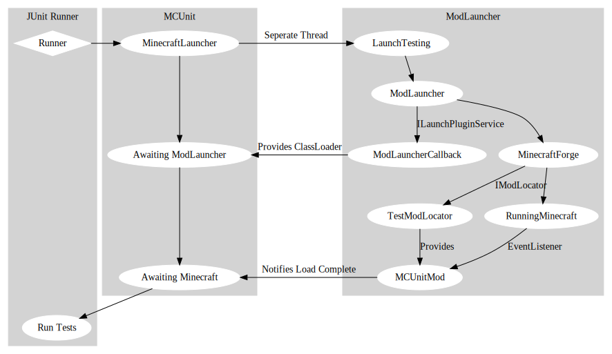

# MCUnit

Pulled from development version of **[BlockRenderer](https://github.com/AterAnimAvis/BlockRenderer)**

For `BlockRenderer` all I really need is to access a world inside a running `Client`,
As such there's no real drivers implemented apart from `Worlds`.

Most of the `Cucumber` implementation should be fairly well isolated from the pure junit.

Note: I'm temporary using `net.masterthought:cucumber-reporting` to build reports from the json but this should probably be changed.

Note: I'm only really supporting Intellij but other IDE's should work

Requires ModLauncher Spec 4+, an earlier version could be used with a couple of Hacks.

Vendors SneakyThrow which can easily be removed.

Installation / Getting Started
---
- **TODO INSTALLATION SUMMARY**

Quick Start Video

    

Cucumber html report can be found in /run/target/cucumber-html-reports

How it works
--

Todo List
---
- Work out when to unset the ThreadContext ClassLoader
- Cleanup after Failed Tests (Just Worlds.closeWorld()?)
- JUnit 5
- Cucumber Java8 - Should just work?
- Gradle Plugin to generate necessary runs / copy environment variables.
- More Driver Implementation

